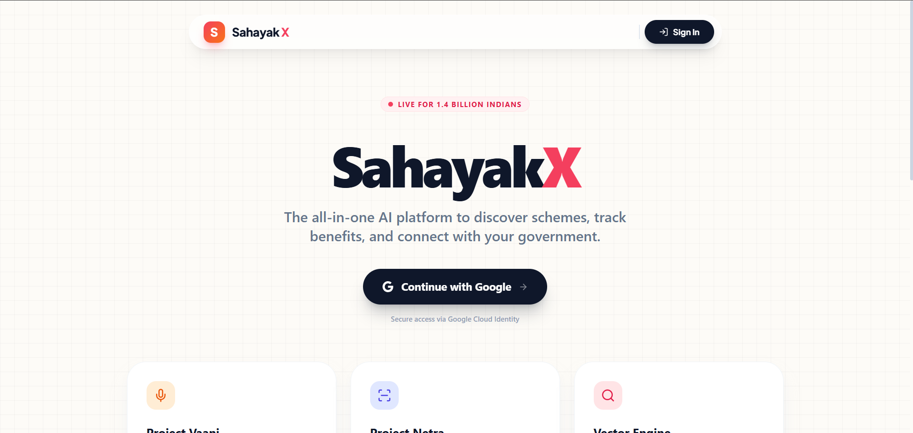
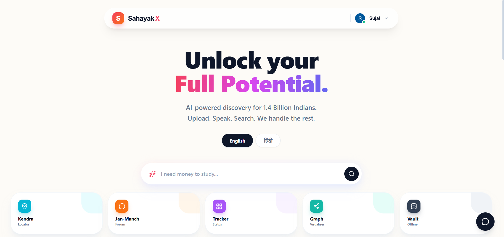

# 🏛️ SahayakX

### The AI-Powered Government Scheme Super App

*🧡 Bridging the gap between Indian citizens and government welfare schemes through AI 🧡*

  
  &nbsp;&nbsp;
  
  &nbsp;&nbsp;
  

---

## 🎯 About

 

 

**SahayakX** is a Next-Gen "Super App" designed to democratize access to government welfare schemes for Indian citizens. By leveraging cutting-edge AI technologies, we simplify:

| 🔍 | ✅ | 📝 | 🗣️ |
|:---:|:---:|:---:|:---:|
| **Scheme Discovery** | **Eligibility Verification** | **Application Assistance** | **Voice Accessibility** |
| Find relevant schemes instantly | Auto-verify using document analysis | Step-by-step guidance | Breaking literacy barriers |

> *"🧡 Making government benefits accessible to every citizen, regardless of their technical literacy."*

---

## ✨ Features

### 🎨 Core Features

<table>
<tr>
<td width="33%" align="center">

  
<b>🔐 Authentication</b>
 
Secure Google OAuth 2.0 with encrypted JWT sessions
</td>
<td width="33%" align="center">

  
<b>👁️ Project Netra</b>
 
Intelligent OCR-powered document analysis
</td>
<td width="33%" align="center">

  
<b>🤖 Sahayak Sarathi</b>
 
Bilingual AI chatbot with RAG system
</td>
</tr>
<tr>
<td width="33%" align="center">

  
<b>🎙️ Project Vaani</b>
 
Voice interface breaking literacy barriers
</td>
<td width="33%" align="center">

  
<b>📍 Sahayak Kendra</b>
 
Geo-locator for nearby help centers
</td>
<td width="33%" align="center">

  
<b>🔒 Doc Vault</b>
 
Encrypted digital locker for documents
</td>
</tr>
<tr>
<td width="33%" align="center">

  
<b>📢 Jan-Manch</b>
 
Community forum with AI moderation
</td>
<td width="33%" align="center">

  
<b>📈 Analytics Engine</b>
 
Real-time impact tracking
</td>
<td width="33%" align="center">

  
<b>📊 Dashboard</b>
 
Comprehensive platform insights
</td>
</tr>
</table>

---
